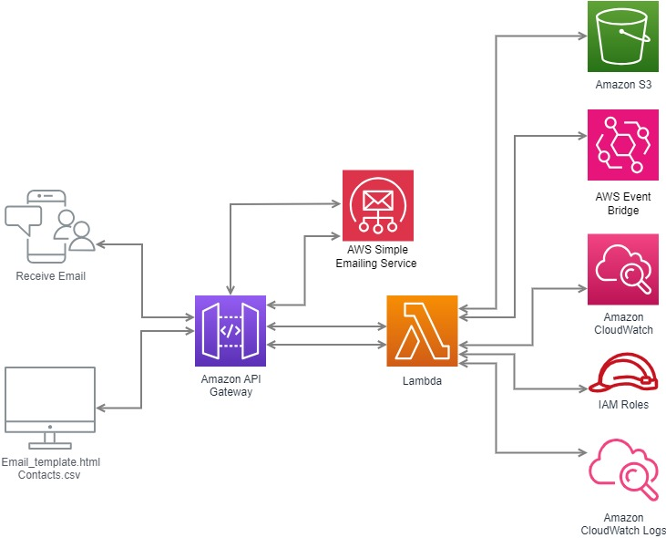

# Bulk Email Marketing Application

his is a Bulk Email Marketing Application built using AWS services such as Amazon Simple Email Service (SES), AWS Lambda, Amazon S3, Amazon EventBridge, and AWS Identity and Access Management (IAM). This application allows you to send bulk emails efficiently and securely.




## Features

- **Bulk Email Sending:** Efficiently send bulk emails using Amazon SES.
- **Event-Driven Architecture:** Utilize AWS Lambda and EventBridge to handle email events such as bounces, complaints, and deliveries.
- **Scalable and Reliable:** Leverage AWS's scalable infrastructure to ensure high availability and reliability.
- **Easy Configuration:** Manage email templates and recipient lists using Amazon S3.

## Architecture

The architecture of this application is based on AWS's serverless services:

1. **Amazon S3:** Stores email templates and recipient lists.
2. **AWS Lambda:** Handles the processing of bulk email requests and email event notifications.
3. **Amazon SES:** Sends emails and reports back events like bounces and complaints.
4. **Amazon EventBridge:** Captures events generated by SES and routes them to Lambda functions for processing.
5. **IAM Roles**: Manages permissions for accessing AWS services.

## AWS Services Used

- **Amazon SES:** To send emails and handle email events.
- **AWS Lambda:** For processing email requests and event notifications.
- **Amazon S3:** To store email templates and recipient lists.
- **Amazon EventBridge:** To handle event-driven email processing.
- **AWS IAM**: To manages permissions for accessing AWS services.

## Setup and Installation

### Prerequisites

- An AWS account with SES, Lambda, S3, and EventBridge services enabled.
- AWS CLI configured with the appropriate permissions.
- python installed for running Lambda functions (if using Node.js runtime).

### Steps

1. **Clone the repository:**

    ```bash
    git clone https://github.com/tanay0608/Bulk_Email_Marketing.git
    cd Bulk_Email_Marketing-app
    ```

2. **Set up your AWS resources:**
   - Create an S3 bucket for storing email templates and recipient lists.
   - Set up an SES domain and verify your sender email address.
   - Create an IAM role with necessary permissions for Lambda.

3. **Deploy Lambda functions:**
   - Package and deploy the Lambda functions using the AWS CLI or an infrastructure as code tool like AWS SAM or Terraform.

4. **Configure EventBridge:**
   - Create rules in EventBridge to capture SES events and route them to the appropriate Lambda functions.

5. **Upload Email Templates and Recipient Lists:**
   - Upload your email templates and recipient lists to the S3 bucket.

6. **Configure SES for Event Handling:**
   - Set up SES to send bounce, complaint, and delivery notifications to EventBridge.

## Usage

1. **Upload a recipient list and email template to the S3 bucket:**
   - Upload a CSV file with the list of recipients to the designated S3 bucket.
   - Upload an HTML or plain text file as the email template.

2. **Invoke the Lambda Function:**
   - Trigger the Lambda function manually or through an API Gateway endpoint to start sending emails to the list of recipients.

3. **Monitor Email Events:**
   - Use CloudWatch logs or a designated monitoring system to track email events such as deliveries, bounces, and complaints.


## Contributing

Contributions are welcome! Please submit a pull request or open an issue to discuss any changes or enhancements.

## License

This project is licensed under the MIT License - see the [LICENSE](LICENSE) file for details.
